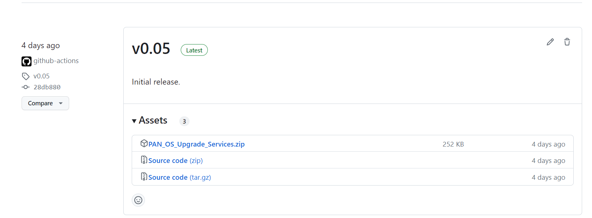
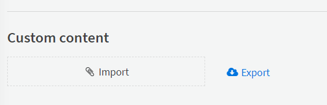

# Installation

## Requirements

 * XSOAR Enterprise + TIM License
 * Panorama deployed
 * Network access between Cortex XSOAR and Github Container Registry

## Installing the pack

1. From the [Github releases page](https://github.com/PaloAltoNetworks/xsoar-panos-upgrade-automation/releases), chose the latest release.
2. Download the Upgrade Services zip file.

3. In your XSOAR server, navigate to settings->about->troubleshooting.
4. At the bottom of the page, upload the zip file. It can take up to 5 minutes to upload to the server

## Configuring the integrations

1. Configure the Core Rest API integration.
2. Configure an instance of the PAN-OS integration - ensuring you're using the Panorama server.
3. Configure the PAN-OS Device Management integration.
4. Configure the PAN-OS Assurance Testing integration.

Optionally:

5. Configure the Palo Alto Networks Security Advisories Integration

Now you should be done. You'll see your connected firewalls appear under Threat Intel, and be able to launch upgrades
and assurance testing from there.